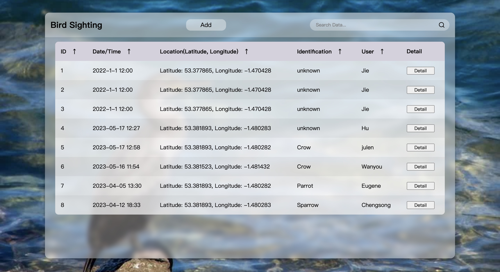
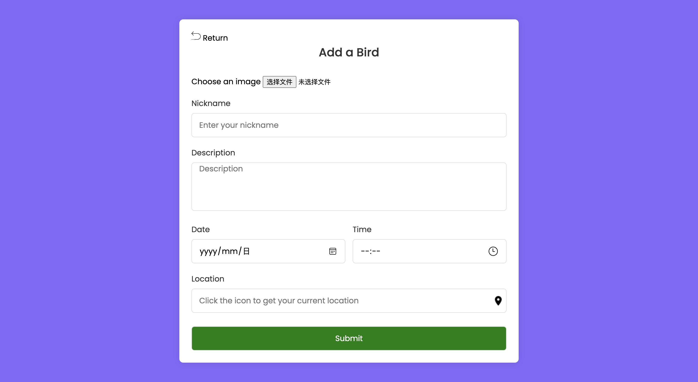
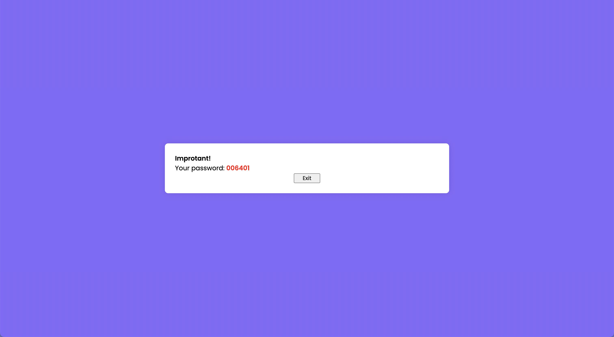
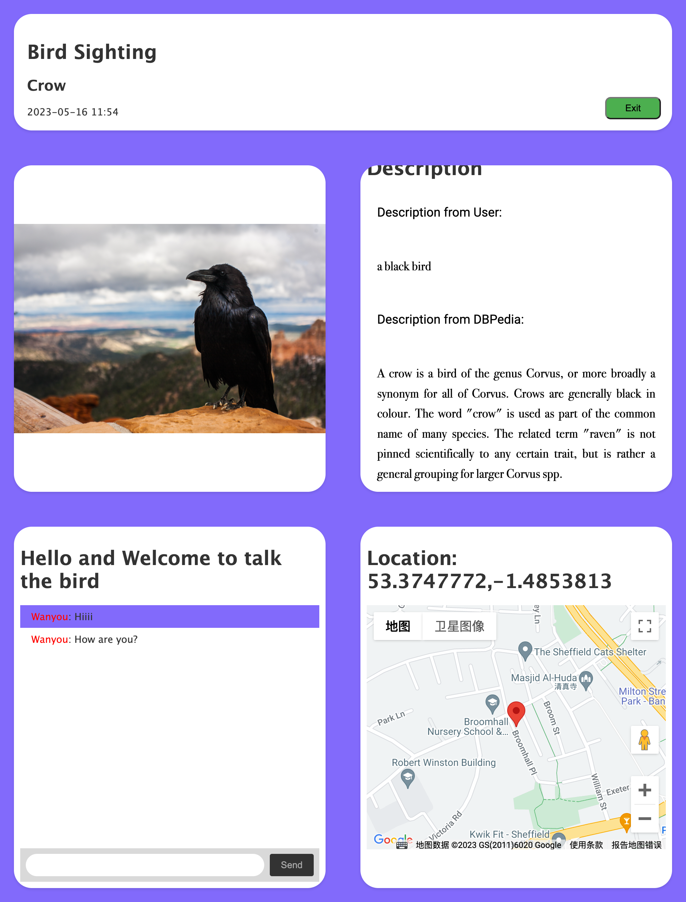

# birdwatching_assignment
This is the Progressive Web Application of Birdwatching.

This project is a progressive web application written using the express framework.

In order to run the project correctly, make sure that Webstorm or the relevant IDE is installed and that the node.js
environment is configured. Then you need to open the project and right mouse click on the package.json file and click 
'Run npm install' and wait for all dependencies and modules to be installed. Or open the terminal in the project file 
directory and enter the following command:
```javascript
npm install
```
Finally, run the program from /bin/www. Then you can go to any browser you are using and enter the URL: [localhost:3002](localhost:3002)

The program includes three main interfaces: list page, add page and review page.

The list page is where the user enters, where the user can see all the birding events uploaded by the user, and also 
can filter the events that meet the criteria through the search bar. Users can also sort by time by clicking on the 
date/time table header of the table.




The table header has an add button on top of it, and the user can click the button to enter the add page to add a new 
event. After the user fills in all the information click on the upload option, if the upload is successful the 
interface will display a unique password belonging to the uploader.

**Note: Please make sure to remember this password.**





Similarly, in the last column of each new event in the list page, there is a detail button that users can click to jump
to the review page to view the details of the event and enter their name in the chat section to chat online, while the 
publisher can enter their password in the chat section and then directly modify the bird's identification and save it. 
In the description screen, the uploader's description of the bird is displayed and the DBpedia description of the bird 
is displayed and linked after the identification of the bird is determined.



Finally the progressive web application can be downloaded directly from the web and can display offline all the data 
cached before disconnection.